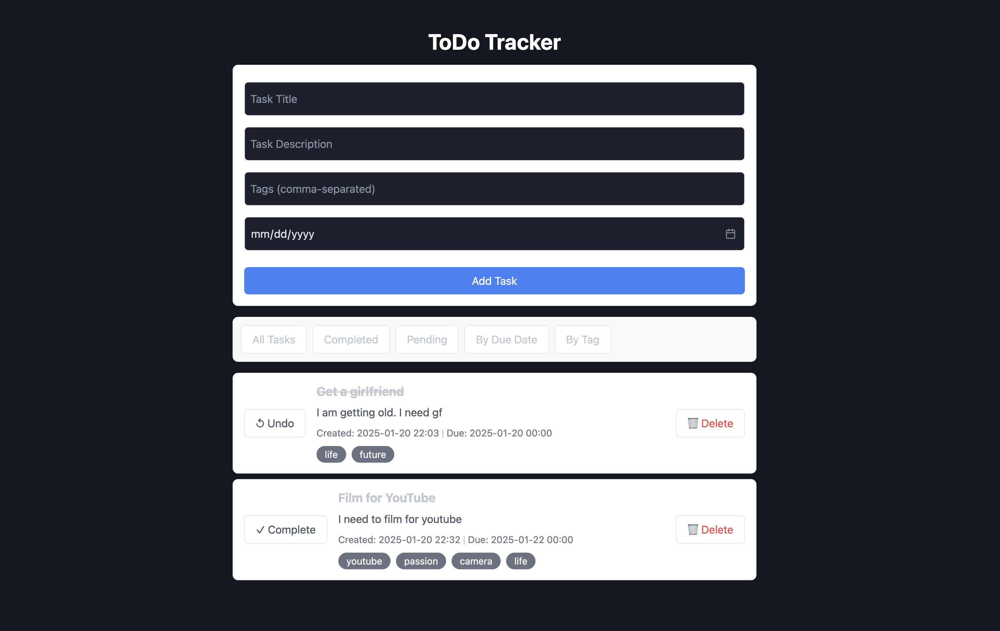

# FastHTML Todo Tracker
## Overview
The FastHTML Todo Tracker is a simple web application that allows users to manage their todo items efficiently. Built using FastHTML and SQLite, this app provides a user-friendly interface for adding, filtering, and sorting tasks.
## Features
- Add todo items with a title, body, creation time, due date, and tags.
- Toggle view to show only completed tasks.
- Sort tasks by creation date or due date.
- Filter tasks by clicking on tags.



## Project Structure
```
fasthtml-todo
├── static
│   └── styles.css
├── data
│   └── todos.sql
├── main.py
├── requirements.txt
├── todos.db
├── favicon.ico
└── README.md
```
## Installation
1. Clone the repository:
   ```
   git clone <repository-url>
   ```
2. Navigate to the project directory:
   ```
   cd fasthtml-todo
   ```
3. Install the required dependencies:
   ```
   pip install -r requirements.txt
   ```
## Usage
1. Run the application:
   ```
   python main.py
   ```
2. Open your web browser and go to `http://localhost:5001` to access the Todo Tracker.
## License
This project will be licensed under the MIT License.